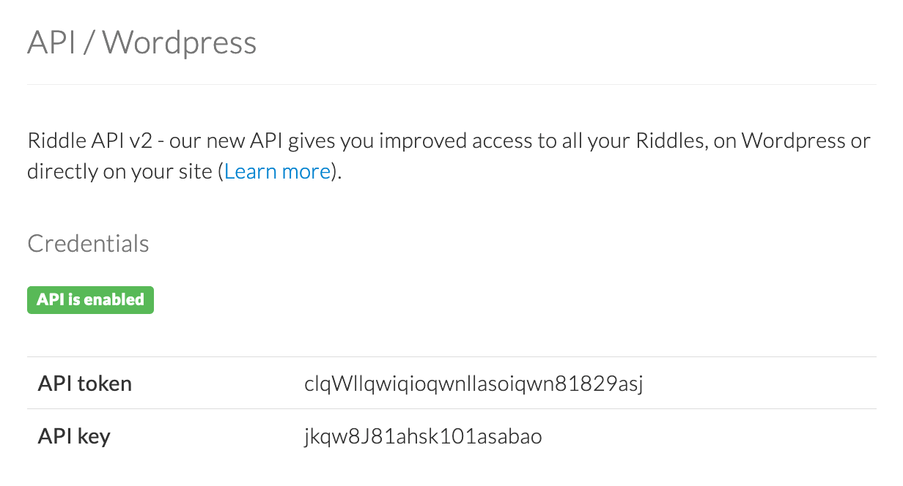
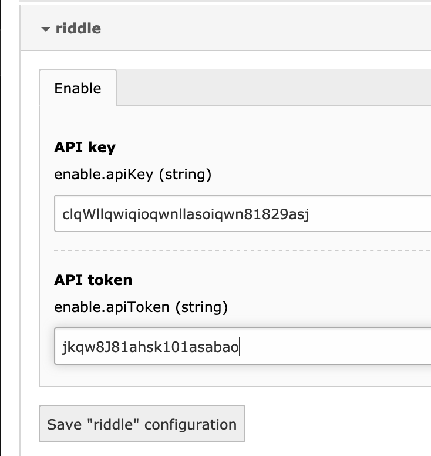

.. ==================================================
.. FOR YOUR INFORMATION
.. --------------------------------------------------
.. -*- coding: utf-8 -*- with BOM.

.. include:: ../../Includes.txt

.. _installation:

Installation
============

.. note::

     As this extension integrates riddle.com, you need of course also an account on riddle.com and create some riddles there.

Get the extension
~~~~~~~~~~~~~~~~~
The installation and initial configuration of the extension is as following:

Install the extension with the extension manager or by using composer using `composer require studiomitte/riddle`.

Setup
~~~~~
It is time to login at https://www.riddle.com and copy your *API key* and *API token*. You can find those on your Account Page > API

   Account settings on riddle.com

Now switch to the extension settings and provide the *API key* and *API token*.

   Settings for riddle within the Extension Settings

TypoScript inclusion
~~~~~~~~~~~~~~~~~~~~
The TypoScript located at file:`EXT:riddle/ext_typoscript_setup.typoscript` is loaded normally by default.
However, depending on your setup you might need to load that manually.

You are done
~~~~~~~~~~~~
You are done and you can now embed riddles which is described here: :ref:`usage`.
