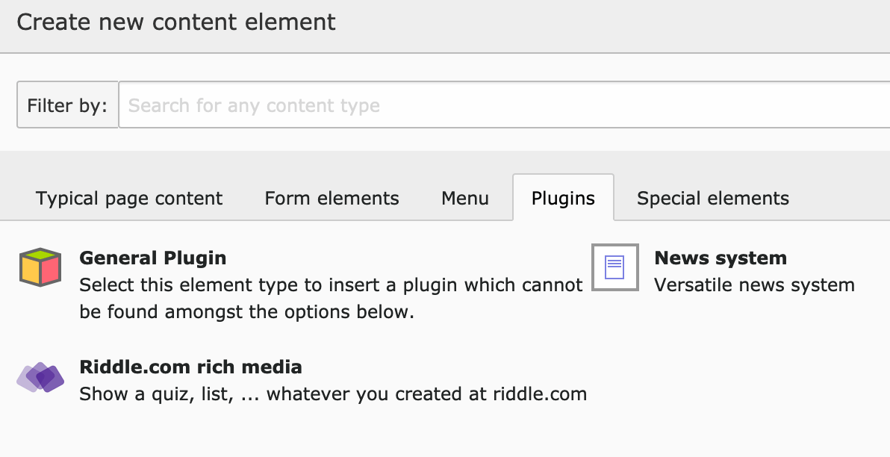

.. ==================================================
.. FOR YOUR INFORMATION
.. --------------------------------------------------
.. -*- coding: utf-8 -*- with BOM.

.. include:: ../../Includes.txt

.. _usage:

Usage
=====

Create new content element
~~~~~~~~~~~~~~~~~~~~~~~~~~
Using this extension is very simple. Create a new plugin on any page and use the **Content Element Wizard** to select the riddle plugin.

   Content Element Wizard

Select a riddle
~~~~~~~~~~~~~~~
Now select one riddle and you are done

.. figure:: ../../Images/backend-plugin.png
   :width: 500px
   :alt: Content Element

   Content Element riddle.com integration
