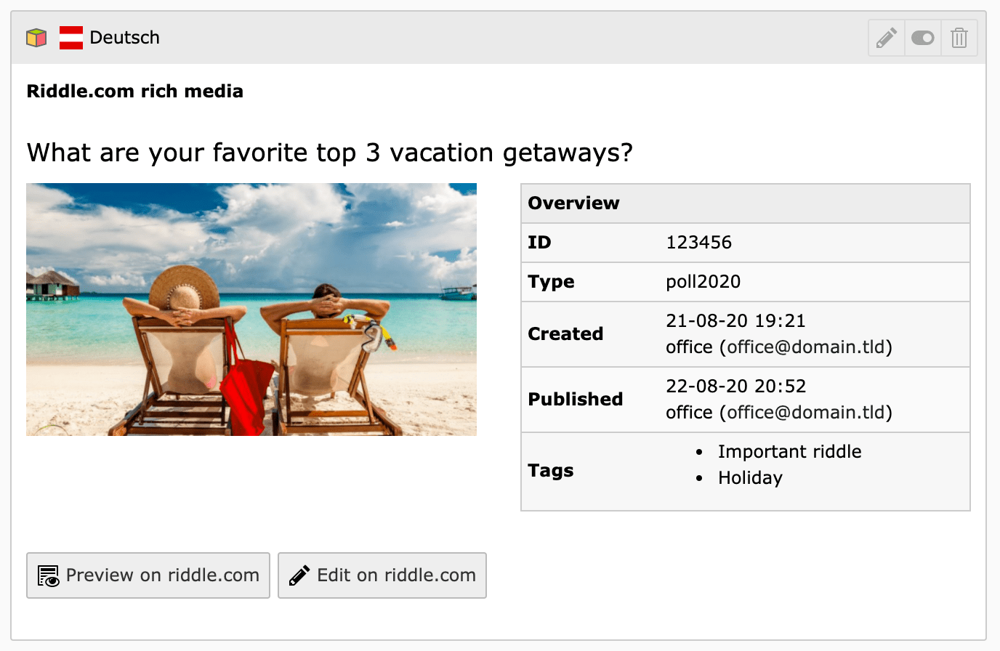

# TYPO3 Extension `riddle`


This extension embeds rich media from [riddle.com](https://www.riddle.com)



## Installation

Install the extension as any other extension.
Either use `composer require studiomitte/riddle` or by downloading it from the [TYPO3 Extension Repository](https://extensions.typo3.org/extension/riddle).

Now switch to the [riddle.com account page](https://www.riddle.com/creator/account/api), enable the API and copy the **API token** and **API key**.


Open the settings in TYPO3 Install Tool and paste the 2 keys there.


## Usage

After creating and publishing a riddle on [riddle.com](https://www.riddle.com) you can create a new plugin in TYPO3 **Riddle.com rich media**.

Now you are done.

## GDPR

riddle.com is hosting their riddles on their own servers in Germany and don't save any personal data of users.

Therefore you are not required to ask your website users for permissions displaying the iframe.

## Modify rendering

The rendering is controlled with the TypoScript shipped in the `ext_typoscript_setup.typoscript` which is loaded by default.

```typo3_typoscript
tt_content.list.20.riddle_riddle = USER
tt_content.list.20.riddle_riddle {
    userFunc = StudioMitte\Riddle\Plugin\RiddlePlugin->run
}
```

If you want to adopt the rendering, override the `userFunc` and provide a custom entrypoint.
